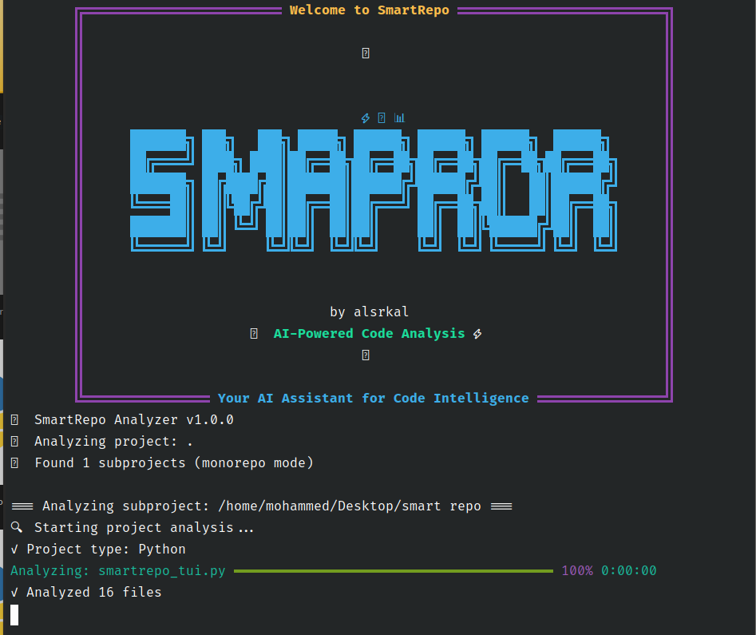

# SmartRepo Analyzer - Setup and Usage Guide
# سمارت ريبـو: أداة تحليل المستودعات الذكية - دليل الاستخدام

---



*Terminal welcome screen and analysis progress*
*شاشة الترحيب في الطرفية وتقدم التحليل*

### 1. Installation
#### ١. التثبيت

```bash
# Clone or download the SmartRepo Analyzer
# استنسخ أو نزّل الأداة

git clone https://github.com/ALSRKAL/smartrepo-analyzer.git
cd smartrepo-analyzer

# Create and activate virtual environment (recommended)
# أنشئ وفعّل بيئة افتراضية (مستحسن)
python -m venv venv
source venv/bin/activate  # On Windows: venv\Scripts\activate

# Install dependencies
# ثبّت المتطلبات
python smartrepo_analyzer.py create-requirements
pip install -r requirements.txt

# Optional: Install Mermaid CLI for diagram generation
# اختياري: ثبّت أداة Mermaid CLI لرسم المخططات
npm install -g @mermaid-js/mermaid-cli
```

### 2. Basic Usage
#### ٢. الاستخدام الأساسي

```bash
# Analyze a project in current directory
# حلّل مشروعًا في المجلد الحالي
python smartrepo_analyzer.py analyze .

# Analyze a specific project
# حلّل مشروعًا محددًا
python smartrepo_analyzer.py analyze ./my-project

# Specify custom output directory
# حدد مجلد إخراج مخصص
python smartrepo_analyzer.py analyze ./my-project --output ./analysis-results

# Verbose output
# إخراج مفصل
python smartrepo_analyzer.py analyze ./my-project --verbose
```

---

## 📋 Command Reference
### مرجع الأوامر

### `analyze` - Main Analysis Command
#### `analyze` - أمر التحليل الرئيسي

```bash
python smartrepo_analyzer.py analyze <project_path> [OPTIONS]
```

**Arguments:**
- `project_path`: Path to the project directory to analyze

**المعطيات:**
- `project_path`: مسار مجلد المشروع المراد تحليله

**Options:**
- `--output`, `-o`: Custom output directory for generated files
- `--verbose`, `-v`: Enable verbose logging
- `--help`, `-h`: Show help for this command

**الخيارات:**
- `--output`, `-o`: مجلد إخراج مخصص للملفات الناتجة
- `--verbose`, `-v`: تفعيل الإخراج المفصل
- `--help`, `-h`: عرض المساعدة لهذا الأمر

### `create-requirements` - Setup Helper
#### `create-requirements` - توليد ملف المتطلبات

```bash
python smartrepo_analyzer.py create-requirements
```

Creates a `requirements.txt` file with all necessary dependencies.
ينشئ ملف `requirements.txt` بجميع المتطلبات اللازمة.

---

## 📊 Example Analysis Sessions
### أمثلة جلسات التحليل

(يمكنك إبقاء الأمثلة البرمجية كما هي، أو إضافة شرح عربي مختصر تحت كل مثال إذا رغبت)

---

## 📁 Generated Output Files
### الملفات الناتجة بعد التحليل

### 1. `readme-enhanced.md`
- **Purpose**: Complete, professionally formatted README
- **الغرض**: ملف README كامل واحترافي
- **Contents**: Project overview, architecture, dependencies, installation steps, usage examples
- **المحتوى**: نظرة عامة، معمارية، متطلبات، خطوات تثبيت، أمثلة استخدام
- **Features**: Auto-generated badges, metrics, and documentation
- **الميزات**: شارات ومقاييس وتوثيق تلقائي

### 2. `architecture.mmd` & `architecture.png`
- **Purpose**: Visual project architecture
- **الغرض**: رسم معماري مرئي للمشروع
- **Format**: Mermaid diagram (.mmd) and PNG image (.png)
- **الصيغة**: مخطط Mermaid و صورة PNG
- **Shows**: Component relationships, file organization, data flow
- **يعرض**: العلاقات بين المكونات وتنظيم الملفات وتدفق البيانات

### 3. `ai-summary.json`
- **Purpose**: Machine-readable project analysis
- **الغرض**: تحليل المشروع بصيغة قابلة للمعالجة آليًا
- **Format**: Structured JSON with complete metadata
- **الصيغة**: JSON منظم مع بيانات وصفية كاملة
- **Use cases**: AI processing, automated documentation, project indexing
- **الاستخدامات**: معالجة بالذكاء الاصطناعي، توثيق تلقائي، فهرسة المشاريع

### 4. `prompt-ready.md`
- **Purpose**: AI-optimized documentation chunks
- **الغرض**: توثيق مقسم وجاهز للذكاء الاصطناعي
- **Contents**: Context-rich summaries for LLM consumption
- **المحتوى**: ملخصات غنية بالسياق للاستخدام مع نماذج اللغة الكبيرة
- **Features**: Keyword tagging, natural language descriptions
- **الميزات**: كلمات مفتاحية ووصف بلغة طبيعية

---

## 🔧 Advanced Configuration
### إعدادات متقدمة

(يمكنك إبقاء الأكواد كما هي، أو إضافة شرح عربي مختصر تحت كل كود)

---

## 🐛 Troubleshooting
### استكشاف الأخطاء وإصلاحها

(يمكنك إبقاء الحلول البرمجية كما هي، أو إضافة شرح عربي مختصر تحت كل حل)

---

## 🔄 Integration Examples
### أمثلة التكامل مع أدوات أخرى

(يمكنك إبقاء الأمثلة كما هي، أو إضافة شرح عربي مختصر تحت كل مثال)

---

## 📈 Performance Tips
### نصائح الأداء

(يمكنك إبقاء النقاط كما هي، أو إضافة ترجمة عربية مختصرة)

---

## 🤝 Contributing
### المساهمة

(يمكنك إبقاء النقاط كما هي، أو إضافة ترجمة عربية مختصرة)

---

## 📄 License
### الرخصة

SmartRepo Analyzer is released under the MIT License. See LICENSE file for details.
تم إصدار SmartRepo Analyzer تحت رخصة MIT. راجع ملف LICENSE للمزيد من التفاصيل.

---

**Ready to analyze your first project?**
**هل أنت مستعد لتحليل مشروعك الأول؟**

```bash
python smartrepo_analyzer.py analyze . --output ./my-analysis
```

---

**This project is ready for publishing on GitHub at [ALSRKAL](https://github.com/ALSRKAL).**
**المشروع جاهز للنشر على GitHub في حساب [ALSRKAL](https://github.com/ALSRKAL).**

---

## ⚡️ Analysis Modes (Fast or Full?)
### ⚡️ أوضاع التحليل (سريع أم شامل؟)

You can choose the analysis mode that fits your needs:
يمكنك اختيار وضع التحليل المناسب حسب حاجتك:

### 1. Fast Analysis (Recommended for large projects)
#### ١. التحليل السريع (موصى به للمشاريع الكبيرة)

- Much faster, skips code complexity analysis (radon)
- أسرع بكثير، يتجاوز تحليل التعقيد (radon)
- Good for a quick overview
- مناسب إذا كنت تريد نظرة عامة سريعة

```bash
python smartrepo_analyzer.py analyze . --output ./smartrepo-analysis
```

### 2. Full Analysis with Complexity
#### ٢. التحليل الشامل مع التعقيد

- Slower, but gives you code complexity details
- أبطأ، لكنه يعطيك تفاصيل تعقيد الشيفرة
- Shows a progress bar and remaining time during complexity analysis
- يظهر شريط تقدم ووقت متبقي أثناء تحليل التعقيد

```bash
python smartrepo_analyzer.py analyze . --output ./smartrepo-analysis --complexity
```

> **Note:**
> - If you enable `--complexity`, a dedicated progress bar will appear for complexity analysis.
> - إذا فعّلت خيار `--complexity` سيظهر شريط تقدم خاص لتحليل التعقيد.
> - If you don't enable it, the analysis will skip this step for speed.
> - إذا لم تفعّله، سيتجاوز التحليل هذه الخطوة لتسريع العملية.

---

## 🛠️ External Tool Requirements
### 🛠️ متطلبات الأدوات الخارجية

For best results, make sure to install the following tools:
للحصول على أفضل النتائج، تأكد من تثبيت الأدوات التالية:

- **radon** (for complexity analysis):
  ```bash
  pip install radon
  ```
- **bandit** (for security analysis):
  ```bash
  pip install bandit
  ```

If not installed, you will see an error indicating the missing tool.
إذا لم تكن مثبتة، سيظهر لك خطأ يوضح الأداة الناقصة. 
